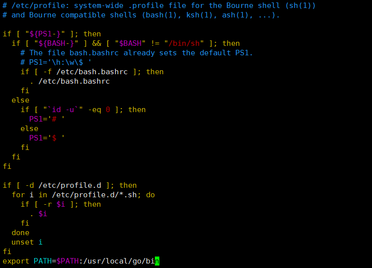

# Randomness-Beacon
VRF,PBFT,Time Commitment

## Golang
```
wget -c https://dl.google.com/go/go1.19.3.linux-amd64.tar.gz -O - | sudo tar -xz -C /usr/local
export PATH=$PATH:/usr/local/go/bin
source ~/.profile

sudo vim /etc/profile
最后一行加入 export PATH=$PATH:/usr/local/go/bin

sudo vim /etc/sudoers
在这行加入go的/usr/local/go/bin路径：
保存退出后，再次使用sudo go 

export GO111MODULE=on
export GOPROXY=https://goproxy.cn
```




## Go-Algorand
### Initial environment setup:

```
git clone https://github.com/algorand/go-algorand
cd go-algorand
sudo ./scripts/configure_dev.sh
sudo ./scripts/buildtools/install_buildtools.sh
```

### build

```
sudo make install
```

## Randomness Beacon
```
sudo git clone https://github.com/PsyduckLiu/Randomness-Beacon.git
cd Randomness-Beacon
cd Command
```
